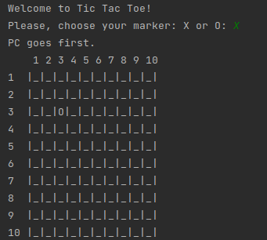
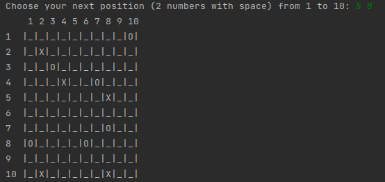
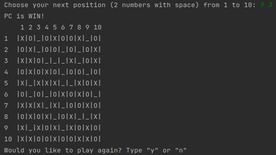

# Reverse Tic-Tac-Toe

Reverse Tic-Tac-Toe game (10x10) on Python against PC with simple AI.

The loser is the one who collects 5 of his chips in a row

## Gaming screenshots

### Beginning

### Course of the game

### Example of the one game end

The PC wins because the user has 5 of his contiguous 
chips in the lower left diagonal: from 10.2 to 6.6

